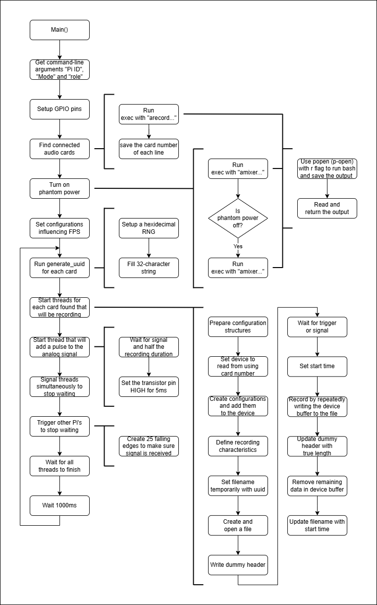

# recordingModule

## Gebruik
* Sluit de GNSS ontvangers, audio interfaces en hydrofoons aan.
* Sluit de bedrading aan voor de synchronisatie puls en de start opname trigger.
* Zet de Pi's aan door ze van stroom te voorzien met een adapter van minimaal 5 Volt 2 Ampère.
* Laat de Pi's verbinden met je hotspot en sluit je laptop aan met de hotspot.
* Start met python op je laptop achtereenvolgens; `server.py`, `synchronize.py`, `analyze.py` en `visualize.py`. (Hiervoor kan je ook `pipeline.ahk` gebruiken.)
* Start met python op elke Pi `client.py`.
* Start op de Pi's opeenvolgend de drie verschillende programma's: `./pr 3 demo 0`, `./pr 2 demo 0` en `./pr 1 demo 1`. Dus op elke Pi draait een verschillend ingestelde instantie van het programma '`pr`'.

## Raspberry Pi setup
Om gebruik te kunnen maken van de Pi moet deze eerst ingesteld worden. Dit kan gedaan worden door het OS te flashen op een micro-SD kaart m.b.v. [PI OS flasher](https://www.raspberrypi.com/software/). De aanwezige Pi's zijn al ingesteld met de volgende credentials:
* User: hydro
* Pass: phone

Verder zijn de volgende twee folders aangemaakt:
```bash
mkdir Downloads/recordingModule
mkdir Downloads/recordingModule/recordings
```

## Verbinding
Om bestanden door te laten sturen is er gebruik gemaakt van een client-server model. Stel bij de Pi's de eigen hotspot in als bekend netwerk. Verbind de laptop ook aan de hotspot. Dit heeft een aantal voordelen:
* De Pi verbind automatisch met de hotspot wanneer deze wordt aangezet.
* Er hoeft geen scherm op de Pi aangesloten worden om ermee te kunnen werken, ssh kan gebruikt worden.
* Dit zorgt voor flexibiliteit, de hotspot kan op elke locatie aangezet worden, ook zonder internetverbinding.
* Dit zorgt voor robuustheid, er kan geen last gekregen worden van netwerksegmentatie.
* Dit zorgt voor controle, Het is het eigen hotspot en ip-adressen kunnen gemakkelijk bekeken worden.

## Controle met welke Pi er verbonden is
Wanneer men niet zeker met welke van de drie Pi's verbonden is, of welk IP-adres hoort bij welke pi kan de ingebouwde LED bestuurd worden:
* Zorgt ervoor dat de LED niet meteen wordt overscheven met 0:
```bash
sudo sh -c "echo none > /sys/class/leds/ACT/trigger"
```
* Zet de LED aan, met "0" uit:
```bash
sudo sh -c "echo 1 > /sys/class/leds/ACT/brightness"
```

## GPIO
Om gebruik te kunnen maken van de pins van de Pi is gebruik gemaakt van WiringPi:
```bash
git clone https://github.com/WiringPi/WiringPi.git
cd WiringPi
./build
cd ..
rm -rf WiringPi/
```

## Scarlett audio interface setup
Om ervoor te zorgen dat de Pi de audio interface kan herkennen, moeten er een aantal drivers geinstalleerd worden. Het eenvoudigst is om de minimale GUI van Geoffrey Bennett te installeren met [Scarlett GUI](https://github.com/geoffreybennett/alsa-scarlett-gui/blob/master/docs/INSTALL.md).

De volgende bash commands zijn ook terug te vinden in de docs:
```bash
sudo apt -y install git make gcc libgtk-4-dev libasound2-dev libssl-dev
cd Downloads
git clone https://github.com/geoffreybennett/alsa-scarlett-gui
cd src
make -j$(nproc)
sudo make install
./alsa-scarlett-gui
```
Wanneer de audio interface voor het eerst gebruikt wordt, kan deze door de Pi gezien worden als opslag. Om dit op te lossen [moet de +48V fantoom voeding knop ingedrukt worden, vervolgens aangesloten worden aan de Pi, en daarna pas los gelaten worden](https://www.reddit.com/r/Focusrite/comments/v5hys2/cant_disable_mass_storage_on_the_scarlett_solo/?rdt=53824).

## Tijd synchronisatie
Als er gebruik gemaakt wordt van een tijd synchronisatie anders dan via internet, kan deze uitgeschakeld worden om ongewenste updates te voorkomen:
```bash
sudo systemctl stop systemd-timesyncd
sudo systemctl disable systemd-timesyncd
```

## Bij verkeerde tijd
Bij een verkeerde tijd, kan handmatig de tijd opnieuw ingesteld worden:
* via de GUI
preferences > raspberry pi configuration > localisation > timezone > amsterdam
* met bash
```bash
sudo raspi-config
```
* of met bash gezet worden naar de huidige tijd:
```bash
sudo apt install ntpdate
sudo ntpdate pool.ntp.org
```

## Ontwikkeling
Voor sneller begrip van de code zijn hieronder softwarediagrammen te vinden van de belangrijkste bestanden:



## Update en download
Voor het updaten van code kan onder "transfer" `update.sh` gevonden worden waarmee eenvoudig code kan gezet worden naar de Pi. Het `.env` bestand staat in de root folder en ziet er als volgt uit:
```
SSH_USER=hydro
SSH_PASS=phone
ROOT_DIR=C:/Users/.../Documents/GitHub/recordingModule
```
Met `download.sh` kunnen handmatig bestanden van de Pi naar de laptop gezet worden.

## Handige bash commands
* Om een lijst te zien met alle beschikbare audio devices:
```bash
aplay -l
```
* Om een sh bestand executable te maken:
```bash
chmod +x *.sh
```
* [De website waar scarlett audio interface software gedownload kan worden](https://downloads.focusrite.com/focusrite/scarlett-3rd-gen/scarlett-solo-3rd-gen).
* Om audacity op de Pi te gebruiken:
```bash
sudo apt install audacity
```